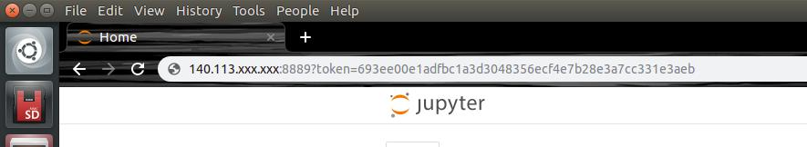

# trailnet-testing-caffe

## Docker build
    
```
pc$ cd trailnet-testing-caffe/Dockerfiles
pc$ source docker_build.sh
```

## 1. Launch docker container

```
pc$ cd trailnet-testing-caffe/
pc$ source docker_run.sh
```

## 2. Run Jupyter notebook

```
container$ source jupyter_run_no_browser.sh 
```

The jupyter token will be shown in the terminal. Please **copy the text after the IP info**, like '?8889?/token=aabbcc009966...' 
Open the browser, type your GPU machine's IP and paste the token info. the sample result is shown below.


Launch **trailnet_evaluation.ipynb** and execute it step by step with **Shift + Enter**
This notebook will 
1. Download the pre-trained model and caffe prototxt file for the **TrailNet**
2. Download the testing dataset to **data/ folder**
3. Conduct prediction and calculate the accurcy

## 3. Open another docker terminal
$ docker exec -it trailnet-caffe-test bash
