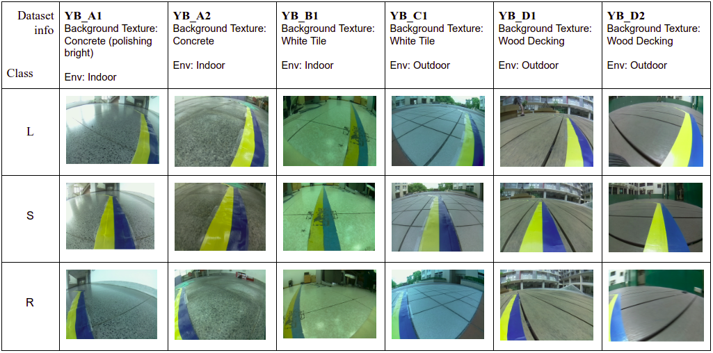

# TrailNet-testing-caffe
This repository is a demostration for the 3-classes deep trial-following model from [Deep Trail-Following Robotic Guide Dog in Pedestrian Environments for People who are Blind and Visually Impaired](https://arg-nctu.github.io/publications/ICRA18_0060_FI.pdf). 

## Docker image preparation
If your GPU is belong to NVIDIA 20XX series, please specify docker image tag with **cuda10.0**, otherwise **cuda8.0**.

 - docker build    
```
pc$ cd trailnet-testing-caffe/Dockerfiles
pc$ source docker_build.sh [cuda8.0 | cuda10.0]
```

 - docker pull
```
pc$ docker pull coolcat647/ros-caffe:[cuda8.0 |cuda10.0]
```

## 1. Launch docker container

```
pc$ cd trailnet-testing-caffe/
pc$ source docker_run.sh
```

## 2. Run Jupyter notebook

```
container$ source jupyter_run_no_browser.sh 
```

The jupyter token will be shown in the terminal. Please **copy the text after the IP info**, like '?8889?/token=aabbcc009966...' 
Open the browser, type your GPU machine's IP and paste the token info. the sample result is shown below.


Launch **trailnet_evaluation.ipynb** and execute it step by step with **Shift + Enter**
This notebook will 
- Download the pre-trained model and caffe prototxt file for the **TrailNet**
- Download the testing dataset to **data/ folder**
- Conduct prediction and calculate the accurcy

## 3.(If need be) Open another docker terminal
```
pc$ docker exec -it trailnet-caffe-test bash
```

## Model description
TrialNet is a deep CNN model maps the input image into three output classes as motion primitives: “Turn Left”, “Go Straight”, and “Turn Right”. To keep the robotic guide dog following the trail. 

## Dataset description
The dataset includes 6 folders which are classified wtih the background texture and environment. The YB-B1 folder is composed with the images which have damaged Yellow-Blue line which is shown below. 


